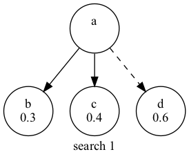
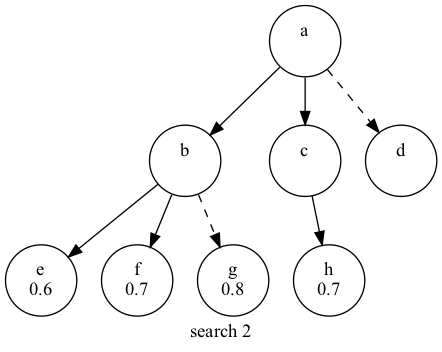
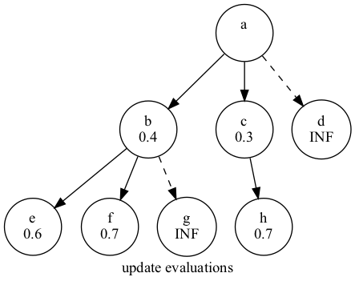

# このプロジェクトについて

IS22erの7班によるボードゲーム「5五将棋」用のAIです。  
ヘッダーファイルを利用し、ビルドにはCMakeとMakefileを用います。


# ビルド方法について

以下のコマンドを(プロジェクトのルートディレクトリで)実行します。
```asm
$ cmake .  # cmakeコマンドのバージョンは3.19以上である必要があります
$ make
```
これによりmainという実行ファイルが作成されるので、`$ ./main 0`などとしてプログラムを実行します。


# コードを書く上での取り決め

盤面は5×5の二次元配列で表し、空きマス、歩、角、飛車、銀、金、王の順に0, 1, 2, 3, 4, 5, 6とする。  
また、歩、銀、角、飛車が成った場合6を足す事とする。  
以上の定数はマクロにしておくので、基本的にはマクロを使い可読性を上げるようにする。  
(例) `#define FU 1`

コード中では、5×5の盤面と持ち駒を入れる配列2つを構造体を用いて一纏めにして扱う。  
持ち駒を入れる配列は6個の要素を持つ配列(例: `int pieces[6]`)とし、インデックスをその駒を表す数字、各要素をその駒の枚数とする。  
(例) 持ち駒として歩を二枚持っているとき: `pieces[FU] = 2`

座標の取り方は以下。("2A3A"等の文字列と下のXY座標との変換は入出力の際に行う)  


# AIの取る戦略

評価関数を用いてゲーム木を探索する。<br>
ただし、同時に全探索も行い、完全な読み切りに成功した場合は、その結果を利用する。


# 評価関数について

ニューラルネットワークのフレームワークを実装し、下図のようなモデルを採用した。


出力層をシグモイド関数にすることで、ニューラルネットワークの出力を (0,1) に制限した。したがって、ニューラルネットワークの出力を手番の勝率とみなすことができる。

| 学習条件一覧               |                | 
| -------------------------- | -------------- | 
| 教師あり学習の訓練データ数 | 360,000        | 
| 教師あり学習の検証データ数 | 96,554         | 
| 自己対戦回数               | 100,000        | 
| 強化学習手法               | モンテカルロ法 | 
| モンテカルロ法のα         | 0.2            | 
| モンテカルロ法のγ         | 0.8            | 
| エポック数                 | 5              | 
| バッチサイズ               | 32             | 
| 最適化関数                 | Adam           | 
| Adamのα                   | 0.001          | 
| Adamのβ1                  | 0.9            | 
| Adamのβ2                  | 0.999          | 
| Adamのε                   | 1e-7           |  

エポック数以下に記載した条件は、教師あり学習と強化学習で共通である。

## 入力について

局面を表す361次元の数値が入力となっている。局面をベクトルに変換する方法について説明する。

### 駒のきき(300次元)

手番と非手番の駒の種類ごとに、各マスについていくつのききがあるかを表現した。駒がある場所ではなく、駒のききを表現することで、駒の動きを学習する必要がなくなると考えた。<br><br>
(例) 手番側の銀および成銀が次の位置にいるとき

|     | A   | B   | C   | D   | E   | 
| --- | --- | --- | --- | --- | --- | 
| 5   |     |     |     |     |     | 
| 4   |     |     |     |     |     | 
| 3   |     | 全  | 銀  |     |     | 
| 2   |     |     |     |     |     | 
| 1   |     |     |     |     |     | 

入力データは、次の2次元グリッドを1列に並べ替えたものである。

|     | A   | B   | C   | D   | E   | 
| --- | --- | --- | --- | --- | --- | 
| 5   | 0   | 0   | 0   | 0   | 0   | 
| 4   | 1   | 2   | 2   | 1   | 0   | 
| 3   | 1   | 0   | 1   | 0   | 0   | 
| 2   | 0   | 2   | 0   | 1   | 0   | 
| 1   | 0   | 0   | 0   | 0   | 0   | 

### 駒の有無(50次元)

手番と非手番の各マスにおける駒の有無を0と1で表現した。

### 持ち駒の数(10次元)

手番と非手番の持ち駒の枚数を各駒について表現した。

### 先手か後手か(1次元)

手番が先手か後手かを0と1で表現した。基本的に千日手は後手勝利となることから、先手と後手は非対称であり、このような入力を追加した。

## 強化学習について

強化学習におけるモンテカルロ法を参考にした。<br>
1手先までを探索する自己対戦で棋譜を生成し、状態が
<!-- $s_0,s_1,...,s_n$ -->
のように遷移したものとする。 (ただし、状態は手番から見た形で表現されているものとする。) 状態
<!-- $s_i$ -->
におけるニューラルネットワークの出力を
<!-- $V(s_i)$ -->
としたとき、添字が大きい順に以下の式で教師データを生成した。


<!-- $$ V(s_i) \leftarrow (1-\alpha)V(s_i) + \alpha R_{i} $$ -->


<!--
$$
R_i =
\left\{
\begin{array}{ll}
1 - ((1-\gamma)V(s_{i+1}) + \gamma R_{i+1}) & (i < n) \\
0 & (i = n)
\end{array}
\right.
$$
-->

### 工夫した点

* <!-- $R_i$ -->
を更新するときに1から前の値を引いているのは、手番から見た形で状態が表現されており、先手と後手が1手ごとに入れ替わるからである。

* 上記の強化学習手法は後ろから評価値を伝播させる仕組みになっているため、終盤だけを先に学習させれば学習速度が速くなると考えた。そこで、モデルに強化学習をさせる前に、詰みと詰み直前のデータ360,000件を学習させた。詰みの評価値は0で、詰み直前の評価値は1であるため、これらについては簡単に教師あり学習を行うことができる。詰みに関するデータセットは、無作為に駒を選んで動かすAIの自己対戦を利用して生成した。このデータセットを学習させた結果、検証データで約99%の正答率を得ることができた。

* 初期盤面からの自己対戦を行った場合、同じような棋譜になって学習が進みにくいと考え、最大10手目まで無作為に駒を選んで動かすようにした。要するに、駒の初期配置を毎回変更した。

* 学習データの駒の位置には偏りがある。例えば、自玉が左下にいる局面は多いが、自玉が右下や右上にいる局面は少ないと推測される。そこで、左右を反転させた盤面を学習データに追加した。全ての駒の動きは左右対称であり、盤面を左右反転させても評価値は変わらないと考えた。

* 誤差逆伝播法を用いてパラメータを自動調整しているが、勾配消失を防ぐために出力層であるシグモイド関数の微分を常に1とした。


# 探索について

マルチスレッドを活用して、評価値を用いた探索と、詰みの探索を別々に行う。

## 評価値を用いた探索について

評価関数を用いてゲーム木の探索を行う。<br>
幅優先探索で局面を探索し、その後ミニマックス法 (ネガマックス法) で評価値を葉から根の方向で更新する。<br>
計算量を削減するために、評価値が高い指手を
<!-- $N(=4)$ -->
個選び、それら以外の指手は探索しないこととした。ゲーム木の高さを
<!-- $H(\approx6)$ -->
とすると、葉ノードの数は
<!-- $N^H$ -->
以下となる。
<br><br>
(例) 
<!-- $N = 2, H = 2$ -->
のとき<br>

* 深さ1の探索



aからdへの遷移は、相手の評価値を高くしてしまうので枝刈りをしてよい。

* 深さ2の探索



同様に、bからgへの遷移も枝刈りしてよい。

* 評価値の更新



<!-- $b = 1 - min(e,f) = 0.4$ -->

<!-- $c = 1 - h = 0.3$ -->

<!-- $a = 1 - min(b,c) = 1 - c$ -->

よって、aからcに遷移する指手を選択すればよい。

## 詰みの探索について

詰みの全探索はpthread.hを用いて、マルチスレッドで行った。
相手が考えている間にも探索を行っているという特長がある。

###前提
- ゲーム木を表すノードはmalloc関数により動的確保する
- あるノードの子ノードは全てヒープキューに格納する
- ヒープに用いられるソート順は、そのノード以下の、敵の行動を表すノードの個数である  


###探索のアルゴリズム
1) ルートノードにロックをかける
2) ルートから順にヒープをポップしていき、葉ノードを見つける
3) ロックを解除する
4) 葉ノードを深さ優先探索により所定の深さだけ拡張する
   1) あるノードで敵が勝利した場合、ノードを適切な位置まで遡って削除する
   2) あるノードで自分が勝利した場合、ヒープ中におけるそのノードの重みを無限大にする
5) 再びルートノードにロックをかけ、葉の更新を各ヒープに反映する
6) ロックを解除する

すなわち、探索は幅優先探索と深さ優先探索の合わせ技である。  
以上により、必敗のパスは全て削除され、必勝のパスはヒープの最後に無限大の重みを持つノードとして存在するようになる。  
ルート直下のヒープに無限大の重みを持つノードがあれば、自分の必勝である。


###生成されるスレッド
探索は8個のスレッドを生成して行っているが、その他にも2つのスレッドが動いている。

1つはメインスレッドであり、メインスレッドではニューラルネットワークによるサーチを行っている。  
これにより、次に取る"仮の行動"を4つほど列挙しておく。もしマルチスレッドによる全探索で詰みまでの道筋が
見つからなければ、この"仮の行動"のうち必敗でないものを採用する。全探索で詰みまでの道筋が見えていれば
それを採用する。

もう一つのスレッドは、ガベージコレクタである。上のアルゴリズムで示したように、動的に確保したノードの削除は
頻繁に起こることであり、上に示した場合以外に、相手が手を打ってルートノードが変化する際などにもノードの削除が起こる。
この削除を簡単かつ高速に行うために、リソースの解放を担当する専用のスレッドを用意し、適宜解放処理をさせている。


###その他
自分の負けが確定した際には、ゲーム木のノードが全て削除されることになり、次に探索すべきノードがなくなってしまう。
そういった場合にはスレッドを終了させるのではなく、待機させることによって回復のタイミングを常に見張るようにしている。


# 参考文献
斎藤康毅. ゼロから作るDeep Learning ―Pythonで学ぶディープラーニングの理論と実装. オライリー・ジャパン, 2016, 298p.
