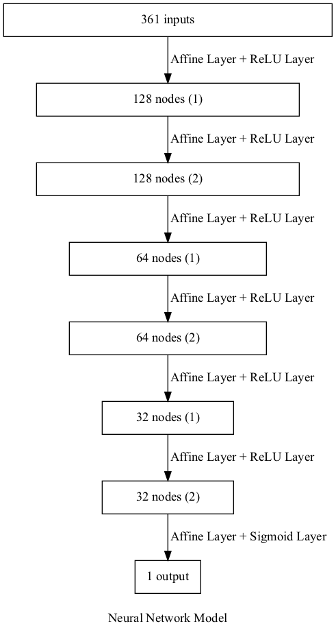

# このプロジェクトについて

IS22erの7班によるボードゲーム「5五将棋」用のAIです。  
ヘッダーファイルやMakefileは作らず、ソースコードを直接includeします。  
(例) `#include "hogehoge.c"`


# ビルド方法について

以下のコマンドを(プロジェクトのルートディレクトリで)実行します。
```asm
$ cmake .  # cmakeコマンドのバージョンは3.20以上である必要があります
$ make
```
これによりmainという実行ファイルが作成されるので、`$ ./main 0`などとしてプログラムを実行します。


# コードを書く上での取り決め

盤面は5×5の二次元配列で表し、空きマス、歩、角、飛車、銀、金、王の順に0, 1, 2, 3, 4, 5, 6とする。  
また、歩、銀、角、飛車が成った場合6を足す事とする。  
以上の定数はマクロにしておくので、基本的にはマクロを使い可読性を上げるようにする。  
(例) `#define FU 1`

コード中では、5×5の盤面と持ち駒を入れる配列2つを構造体を用いて一纏めにして扱う。  
持ち駒を入れる配列は6個の要素を持つ配列(例: `int pieces[6]`)とし、インデックスをその駒を表す数字、各要素をその駒の枚数とする。  
(例) 持ち駒として歩を二枚持っているとき: `pieces[FU] = 2`

座標の取り方は以下。("2A3A"等の文字列と下のXY座標との変換は入出力の際に行う)  


# AIの取る戦略

評価関数とゲーム木探索を用いる。
詳細は未定。


# 評価関数について

ニューラルネットワークのフレームワークを実装し、下図のようなモデルを使用した。



出力層をシグモイド関数にして、ニューラルネットワークの出力を (0,1) に制限した。したがって、ニューラルネットワークの出力を手番の勝率とみなすことができる。

## 入力について

局面を表す361次元の数値が入力となっている。局面をベクトルに変換する方法について説明する。

### 駒のきき(300次元)

手番と非手番の駒の種類ごとに、各マスについていくつのききがあるかを表現した。駒がある場所ではなく、駒のききを表現することで、駒の動きを学習する必要がなくなると考えた。<br><br>
(例) 手番側の銀および成銀が次の位置にいるとき

|     | A   | B   | C   | D   | E   | 
| --- | --- | --- | --- | --- | --- | 
| 5   |     |     |     |     |     | 
| 4   |     |     |     |     |     | 
| 3   |     | 全  | 銀  |     |     | 
| 2   |     |     |     |     |     | 
| 1   |     |     |     |     |     | 

入力データは、次の2次元グリッドを1列に並べ替えたものである。

|     | A   | B   | C   | D   | E   | 
| --- | --- | --- | --- | --- | --- | 
| 5   | 0   | 0   | 0   | 0   | 0   | 
| 4   | 1   | 2   | 2   | 1   | 0   | 
| 3   | 1   | 0   | 1   | 0   | 0   | 
| 2   | 0   | 2   | 0   | 1   | 0   | 
| 1   | 0   | 0   | 0   | 0   | 0   | 

### 駒の有無(50次元)

手番と非手番の各マスにおける駒の有無を0と1で表現した。

### 持ち駒の数(10次元)

手番と非手番の持ち駒の枚数を各駒について表現した。

### 先手か後手か(1次元)

手番が先手か後手かを0と1で表現した。基本的に千日手は後手勝利となることから、先手と後手は非対称であり、このような入力を追加した。

## 強化学習について

強化学習におけるモンテカルロ法を参考にした。<br>
1手先までを探索する自己対戦で棋譜を生成し、状態が
<!-- $s_0,s_1,...,s_n$ -->
のように遷移したものとする。 (ただし、状態は手番から見た形で表現されているものとする。) 状態
<!-- $s_i$ -->
におけるニューラルネットワークの出力を
<!-- $V(s_i)$ -->
としたとき、添字が大きい順に以下の式で教師データを生成する。


<!-- $$ V(s_i) \leftarrow (1-\alpha)V(s_i) + \alpha R_{i} $$ -->


<!--
$$
R_i =
\left\{
\begin{array}{ll}
1 - ((1-\gamma)V(s_{i+1}) + \gamma R_{i+1}) & (i < n) \\
0 & (i = n)
\end{array}
\right.
$$
-->

<!-- $R_i$ -->
を更新するときに1から前の値を引いているのは、手番から見た形で状態が表現されており、先手と後手が1手ごとに入れ替わるからである。<br>
上記の手法は後ろから評価値を伝播させる仕組みになっているため、終盤だけを先に学習させれば学習速度が速くなると考えた。そこで、モデルに強化学習をさせる前に、詰みと詰み直前のデータ360,000件を学習させた。詰みの評価値は0で、詰み直前の評価値は1であるため、これらについては簡単に教師あり学習を行うことができる。

## 誤差逆伝播法について

誤差逆伝播法を用いてパラメータを自動調整しているが、勾配消失を防ぐために出力層であるシグモイド関数の微分を常に1としている。


# 探索について
未定。


# 参考文献
斎藤康毅. ゼロから作るDeep Learning ―Pythonで学ぶディープラーニングの理論と実装. オライリー・ジャパン, 2016, 298p.
